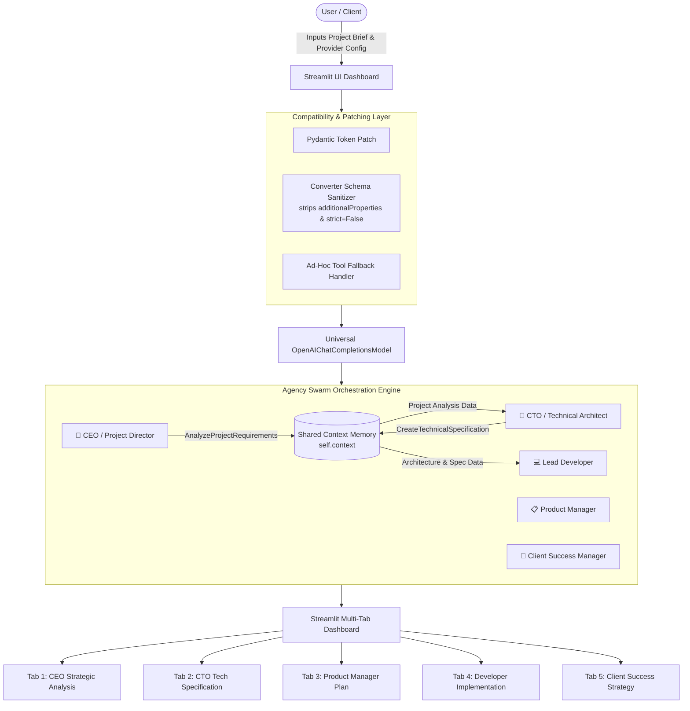
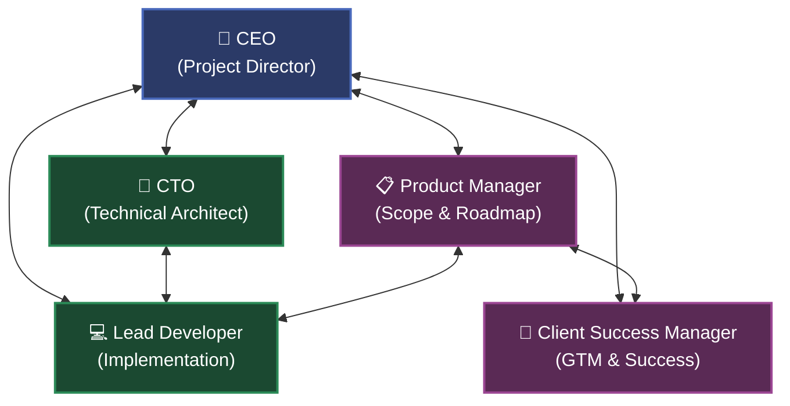
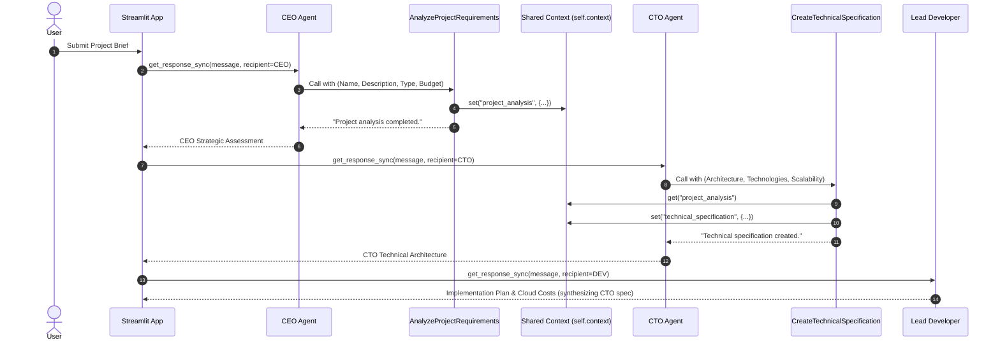

# AI Services Agency 👨‍💼🚀
## Comprehensive Project Description, Architecture & Multi-Agent Communication Guide

---

## 📌 1. What is this Project?

**AI Services Agency** is an enterprise-grade multi-agent software consulting and digital agency application. Built using **[Streamlit](https://streamlit.io/)** and **[Agency Swarm](https://github.com/VRSEN/agency-swarm)**, it simulates a full-service software consulting agency powered by autonomous, specialized AI agents.

In traditional software development, evaluating and planning a project requires multiple senior leadership roles:
- A **CEO** to evaluate strategic fit, business feasibility, and ROI.
- A **CTO** to define the system architecture, tech stack, and scalability.
- A **Product Manager** to determine MVP scope, user stories, and delivery roadmaps.
- A **Lead Developer** to estimate implementation effort, cloud costs, and technical risks.
- A **Client Success Manager** to devise go-to-market (GTM) strategy, customer acquisition, and communication frameworks.

**AI Services Agency** brings this entire executive and engineering leadership suite into a single dashboard. A user inputs a high-level project brief (name, description, budget, timeline, priority, and technical requirements), and the multi-agent system collaborates to produce a complete, 360-degree agency blueprint organized into clean interactive tabs.

---

## ⚙️ 2. How It Works

The application operates as a full pipeline connecting user input, dynamic API configuration, multi-agent orchestration, shared context memory, and structured UI rendering.



### End-to-End Execution Lifecycle:
1. **Provider Setup & Credentials**: The user selects an AI provider (e.g. OmniKey, Google Gemini, OpenRouter, Groq, OpenAI, Ollama) and inputs the corresponding API key and model in the Streamlit sidebar.
2. **Compatibility Patching**: Before calling the models, the system dynamically patches schema definitions and token tracking data structures so non-OpenAI providers (like Gemini or OpenRouter) don't error out on OpenAI-specific JSON schema extensions.
3. **Agent Instantiation**: The application initializes 5 specialized `Agent` instances configured with calibrated temperatures, distinct system instructions, and designated tools.
4. **Agency Assembly**: The agents are grouped into an `Agency` with an explicit communication matrix (`communication_flows`).
5. **Execution & Context Passing**:
   - **CEO** runs first, invoking the `AnalyzeProjectRequirements` tool to validate project complexity, timeline, and budget, saving structured data into `self.context`.
   - **CTO** reads the analysis from context, determines the optimal architecture (monolithic, microservices, serverless, or hybrid), selects the technology stack, and saves the specification into `self.context`.
   - **Product Manager** generates a phased release roadmap, MVP scope, and product-market fit strategy.
   - **Lead Developer** reviews the CTO's technical spec, estimates development milestones, outlines cloud infrastructure, and calculates estimated cloud costs.
   - **Client Success Manager** constructs customer onboarding plans, client communication cadence, and go-to-market strategies.
6. **Synchronized Output**: Results from each agent are delivered in formatted Markdown across dedicated tabs in the Streamlit interface, while preserving complete session history.

---

## 🌐 3. Multi-Model & Multi-Provider Architecture

One of the standout design aspects of this project is its **Provider-Agnostic Multi-Model Architecture**. Instead of being hardcoded to a single LLM vendor (like OpenAI), the application can switch between major cloud providers, unified API gateways, or locally hosted open-source models with zero code changes.

### Supported Providers & Models

| Provider | Supported Models | Base URL / Protocol | Key Format / Notes |
|---|---|---|---|
| **OmniKey AI** | `gemini-2.5-flash`, `gemini-1.5-flash`, `gpt-4o-mini`, `gpt-4o`, `llama-3.3-70b-versatile`, `claude-3-5-sonnet` | `https://omnikey-ai-unified-key-manager.onrender.com/v1` | Unified OpenAI-compatible key router (`omnikey-...`) |
| **Google Gemini** | `gemini-2.5-flash`, `gemini-2.5-pro`, `gemini-1.5-flash` | `https://generativelanguage.googleapis.com/v1beta/openai/` | Google AI Studio key (`AIza...`). Uses Gemini's native OpenAI endpoint |
| **OpenRouter** | `google/gemini-2.0-flash-exp:free`, `meta-llama/llama-3.3-70b-instruct:free`, `deepseek/deepseek-chat`, `openai/gpt-4o-mini` | `https://openrouter.ai/api/v1` | OpenRouter key (`sk-or-...`). Access to dozens of free and commercial models |
| **Groq** | `llama-3.3-70b-versatile`, `llama-3.1-8b-instant`, `mixtral-8x7b-32768` | `https://api.groq.com/openai/v1` | Groq key (`gsk_...`). Ultra-fast LPU inference |
| **OpenAI** | `gpt-4o`, `gpt-4o-mini`, `gpt-4-turbo` | `https://api.openai.com/v1` | Official OpenAI key (`sk-...`) |
| **DeepSeek** | `deepseek-chat`, `deepseek-reasoner` | `https://api.deepseek.com/v1` | DeepSeek key (`sk-...`). Low-cost, high-reasoning models |
| **Ollama (Local)**| `llama3.2`, `llama3.1`, `mistral`, `qwen2.5` | `http://localhost:11434/v1` | 100% private, free local execution (No API key needed) |
| **Custom Endpoint**| Any user-specified model | Customizable URL (e.g. `http://localhost:1234/v1`) | Connects to vLLM, LM Studio, LocalAI, or custom inference servers |

---

### How Multi-Model Compatibility is Achieved Under the Hood

Standard multi-agent frameworks often assume strict adherence to OpenAI's proprietary JSON schema format. When connecting to alternative providers (such as Google Gemini, Groq, or OpenRouter), this often causes crashes. This project solves that problem through three built-in engineering patches:

#### 1. Schema Sanitization Layer (`_clean_schema`)
- **Problem**: Google Gemini and certain OpenRouter models reject function tool schemas containing `"additionalProperties": false` or strict mode flags.
- **Solution**: The application monkey-patches `agents.models.chatcmpl_converter.Converter`:
```python
def _clean_schema(schema):
    if isinstance(schema, dict):
        return {k: _clean_schema(v) for k, v in schema.items() if k != "additionalProperties"}
    elif isinstance(schema, list):
        return [_clean_schema(x) for x in schema]
    return schema
```
It intercepts every tool conversion, recursively strips `additionalProperties`, and sets `strict = False`.

#### 2. Pydantic Token Tracking Patch
- **Problem**: Newer versions of `openai` (`>=2.54.0`) introduced fields such as `cache_write_tokens`, `cached_tokens`, and `reasoning_tokens` into usage tracking models, causing validation errors in agent libraries that expect standard token counters.
- **Solution**: The app injects default values (`0`) and forces a model rebuild (`model_rebuild(force=True)`) at startup, preventing runtime validation crashes across different library versions.

#### 3. Ad-Hoc Tool Fallback Handler
- **Problem**: Some open-source and reasoning models (like DeepSeek or smaller Llama models) occasionally hallucinate tool call names that aren't defined in the agent's toolset.
- **Solution**: The app overrides `_run_impl._build_adhoc_fallback_tool_call` to intercept unrecognized function calls and return synthetic execution feedback (`Tool {name} executed. Please provide your complete analysis...`), allowing the agent pipeline to proceed smoothly without crashing.

#### 4. Universal `OpenAIChatCompletionsModel`
Regardless of whether you select Gemini, Groq, or Ollama, the app wraps the connection in an `AsyncOpenAI(api_key=..., base_url=...)` client and standardizes all agent calls using `OpenAIChatCompletionsModel(model=model_name, openai_client=async_client)`.

---

## 🗣️ 4. How the Agents Talk to Each Other

Multi-agent coordination in this system happens at two distinct levels:
1. **Communication Flow Topology** (The Organization Chart)
2. **Shared Context State** (`self.context`)

---

### A. The Communication Flow Topology (Who Can Talk to Whom)

In Agency Swarm, agents cannot talk to each other arbitrarily; they must be granted explicit permission via `communication_flows`. The application establishes an agency chart that reflects a real-world software consulting company:



#### Permitted Communication Channels:
- **CEO ↔️ CTO**: High-level business requirements are translated into architectural guidelines.
- **CEO ↔️ Product Manager**: Strategic goals and budget boundaries inform scope and timeline.
- **CEO ↔️ Lead Developer**: High-level feasibility checks and risk evaluation.
- **CEO ↔️ Client Success Manager**: Alignment on client expectations, milestones, and value delivery.
- **CTO ↔️ Lead Developer**: Architecture decisions, framework choices, and scalability requirements are handed directly to the engineer for implementation planning.
- **Product Manager ↔️ Lead Developer**: Feature prioritization and backlog estimation against engineering effort.
- **Product Manager ↔️ Client Success Manager**: Product release roadmap aligns with client onboarding and go-to-market plans.

---

### B. Two Methods of Communication

#### Method 1: Delegation & Handoffs (Agency Swarm Communication Protocol)
When an agent is configured with another agent in its `communication_flows`, Agency Swarm automatically injects internal handoff tools (e.g., `SendMessage(recipient=...)`).
- If an agent needs information from another specialist, it can send a message directly to that agent.
- The receiving agent processes the message using its specific prompt and persona, executes any required tools, and returns the response back to the sender.

#### Method 2: Shared Context Memory (`self.context`)
Tools within the agency share a common thread state called `self.context`. This allows agents to pass structured technical data without losing information across conversation turns:



1. **CEO executes `AnalyzeProjectRequirements`**:
   ```python
   analysis = {
       "name": self.project_name,
       "type": self.project_type,
       "complexity": "high",
       "timeline": "6 months",
       "budget_feasibility": "within range",
       "requirements": ["Scalable architecture", "Security", "API integration"]
   }
   self.context.set("project_analysis", analysis)
   ```
2. **CTO executes `CreateTechnicalSpecification`**:
   The CTO tool queries the existing analysis from `self.context.get("project_analysis")` and creates a technical specification:
   ```python
   spec = {
       "project_name": project_name,
       "architecture": self.architecture_type,
       "technologies": [t.strip() for t in self.core_technologies.split(",") if t.strip()],
       "scalability": self.scalability_requirements
   }
   self.context.set("technical_specification", spec)
   ```
3. **Subsequent Agents (PM, Developer, Client Success)**:
   The orchestration script feeds the synthesized context into the prompts for the remaining agents, ensuring full alignment across the entire deliverable.

---

## 👥 5. The 5 Specialized Agents in Detail

### 1. 👔 CEO / Project Director
- **Role**: Executive decision-maker and strategic leader.
- **Model Temperature**: `0.7` (Balanced creativity and strategic vision).
- **Tool**: `AnalyzeProjectRequirements`
- **Key Responsibilities**:
  - Validates business model and strategic viability.
  - Checks if the requested budget matches the scope.
  - Identifies executive risks and market opportunity.

### 2. 📐 CTO / Technical Architect
- **Role**: Principal systems architect.
- **Model Temperature**: `0.5` (Focused, structured, and technical).
- **Tool**: `CreateTechnicalSpecification`
- **Key Responsibilities**:
  - Evaluates architectural patterns (Monolithic vs. Microservices vs. Serverless vs. Hybrid).
  - Selects programming languages, frameworks, and databases.
  - Formulates scaling, high availability, and security measures.

### 3. 📋 Product Manager
- **Role**: Scope, backlog, and delivery lead.
- **Model Temperature**: `0.4` (Organized and precise).
- **Tooling**: Pure text-based reasoning (Direct Markdown).
- **Key Responsibilities**:
  - Establishes MVP feature scope and core user journeys.
  - Constructs a milestone-based delivery roadmap.
  - Clarifies product-market fit and scope trade-offs.

### 4. 💻 Lead Developer
- **Role**: Senior full-stack engineering lead.
- **Model Temperature**: `0.3` (Highly deterministic, technical, and grounded).
- **Tooling**: Pure text-based reasoning (Direct Markdown).
- **Key Responsibilities**:
  - Outlines engineering sprints and modular architecture.
  - Estimates developer effort in story points/weeks.
  - Projects monthly cloud hosting and third-party service costs (AWS/GCP, databases, cache).

### 5. 🎯 Client Success Manager
- **Role**: Customer growth and stakeholder relationship director.
- **Model Temperature**: `0.6` (Engaging and client-focused).
- **Tooling**: Pure text-based reasoning (Direct Markdown).
- **Key Responsibilities**:
  - Develops Go-To-Market (GTM) strategy and launch channels.
  - Designs user onboarding and retention metrics.
  - Establishes sprint communication protocols, SLAs, and reporting cadence.

---

## 🛠️ 6. Tools Reference

The application defines custom tools subclassed from `agency_swarm.BaseTool`:

### Tool 1: `AnalyzeProjectRequirements`
- **Class**: `AnalyzeProjectRequirements(BaseTool)`
- **Parameters**:
  - `project_name` (`str`): Name of the project.
  - `project_description` (`str`): Detailed description and goals.
  - `project_type` (`Literal`): Web Application, Mobile App, API Development, Data Analytics, AI/ML Solution, Other.
  - `budget_range` (`Literal`): $10k-$25k, $25k-$50k, $50k-$100k, $100k+.
- **Effect**: Evaluates basic feasibility and populates the `"project_analysis"` key in `self.context`.

### Tool 2: `CreateTechnicalSpecification`
- **Class**: `CreateTechnicalSpecification(BaseTool)`
- **Parameters**:
  - `architecture_type` (`Literal`): monolithic, microservices, serverless, hybrid.
  - `core_technologies` (`str`): Comma-separated list of frameworks and tools.
  - `scalability_requirements` (`Literal`): high, medium, low.
- **Effect**: Reads `"project_analysis"` from `self.context` and populates `"technical_specification"` into `self.context`.

---

## 🚀 7. Running & Testing the Project

### Prerequisites
- Python 3.10+
- Virtual environment with dependencies installed:
  ```bash
  pip install -r requirements.txt
  ```

### Start the Application
```bash
streamlit run agency.py
```
Or with specific server configurations:
```bash
.venv\Scripts\python.exe -m streamlit run agency.py --server.headless true
```

### Accessing the Web UI
- Open **`http://localhost:8501`** in your web browser.
- Select your AI Provider from the sidebar, paste your API key, enter project requirements, and click **Analyze Project**.
